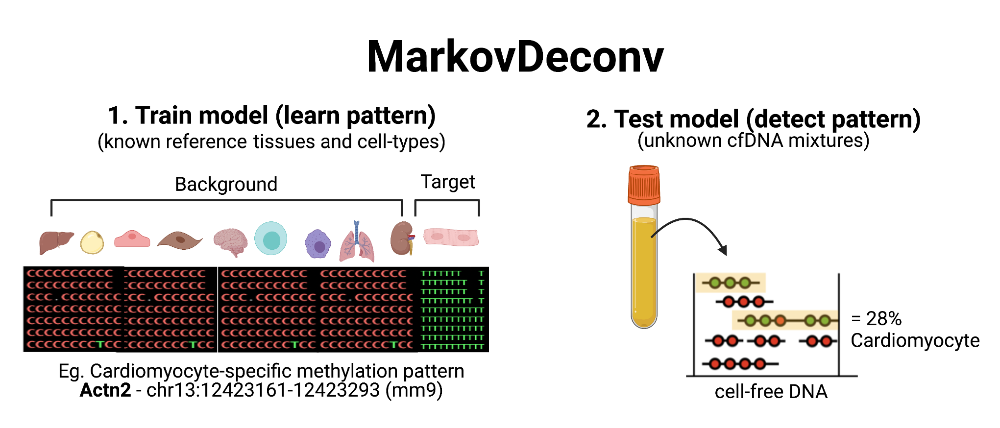

# MarkovDeconv: Cell-type Detection from cell-free methylated DNA in blood samples

MarkovDeconv is a deconvolution model for DNA methylation sequencing data, designed to classify the cellular origins of cell-free DNA (cfDNA) fragments in blood samples. This ultrasensitive method uses read-level CpG methylation patterns to detect trace amounts of cell-type specific signals within complex cfDNA mixtures. Decoding the cellular origins of cfDNA from liquid biopsies serves as a promising new approach for non-invasive monitoring of tissue damage. 

At identified cell-type specific DNA methylation patterns, this model is trained to recognize patterns belonging to cell-types of interest in unknown cfDNA mixtures. The current version of the tool allows for binary classification of each cfDNA molecule as belonging to the cell-type of interest or alternatively is classified as background.



## Quick start
### Installation

First make sure you have [`wgbstools`](https://github.com/nloyfer/wgbs_tools) installed.

```bash
# Clone
git clone https://github.com/nloyfer/MarkovDeconv.git
cd MarkovDeconv/counter/

# compile
make
cd ..
```

#### Dependencies
- python 3+
- samtools

### Usage examples

Now you can detect cfDNA fragments originating from cell-types of interest. 

### Train:
First, `train` the model to distinguish CpG Methylation patterns of the target cell-type from background. 
This command takes as input:
- marker file: a `bed` file with 2 extra columns for CpG indexes. Could be the output of the `wgbstools segment` command, or any custom bed file once you added the [startCpG, endCpG] columns with `wgbstools convert -L BED_FILE`.
- group file: a `csv` table\ text file defining which pat files are target (group1) and which are background (group2)
- pat files: a set of pat files from known reference cell-types to train the model. You can generate [`pat`](https://github.com/nloyfer/wgbs_tools/docs/pat_format.md) files out of `bam` files for each of the reference cell-types using the `[`wgbstools`](https://github.com/nloyfer/wgbs_tools) bam2pat` command.

```bash
python train.py markers.bed -g groups.csv -f -v -o ./my_train_dir --reference_data /path/to/reference/gDNA/files/*pat.gz
```

### Deconvolve:
Then, `deconvolve` unknown cfDNA mixtures to identify molecules originating from the target cell-type 

```bash
python deconvolve.py /path/to/my_train_dir/ -v --target TARGET-CELLTYPE --pats /path/to/test/cfDNA/files/*pat.gz
```


## Workflow Vignette
This tutorial comes with step-by-step details about how to use the MarkovDeconv model

