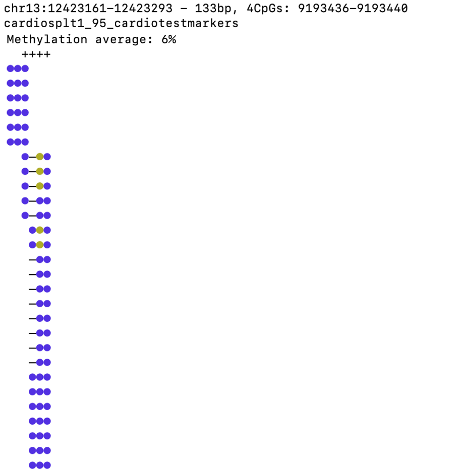
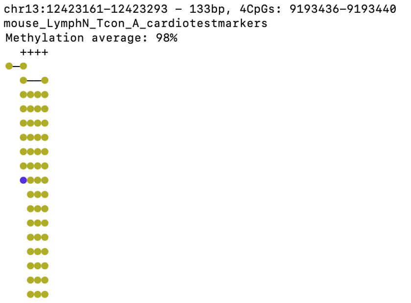
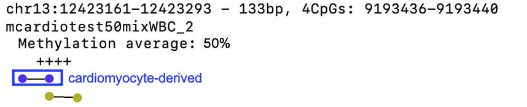
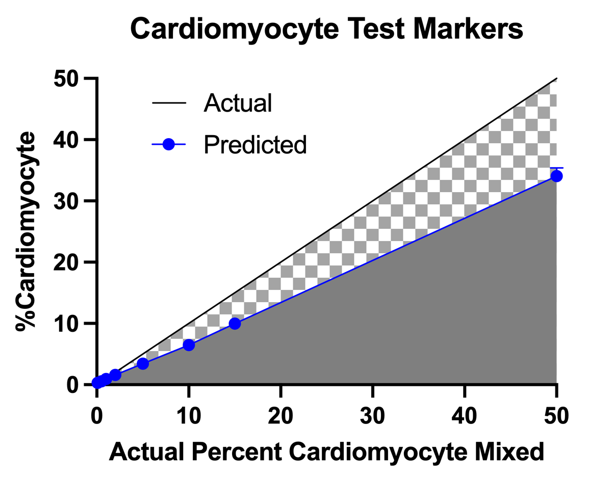

# MarkovDeconv tutorial
## Installation and configuration
First, make sure to have [`wgbstools`](https://github.com/nloyfer/wgbs_tools) installed and configure the `mm9` genome
```bash
git clone https://github.com/nloyfer/wgbs_tools.git
cd wgbs_tools
python setup.py
wgbstools init_genome mm9
```

It is recommended to add wgbstools to your $PATH, E.g,
```bash
export PATH=${PATH}:$PWD
```

Next, install `MarkovDeconv`
```bash
git clone https://github.com/nloyfer/MarkovDeconv.git
cd MarkovDeconv/counter/
make
cd ..
```

## All set. Let's begin
### Data and region
For this short tutorial, we will be demonstrating how MarkovDeconv works on a subset of mouse cardiomyocyte-specific methylation blocks. 

```bash
$ cd tutorial/Data
$ head cardio_testmarkers.bed
#chr    start   end     startCpG        endCpG
chr2	76783821	76784035	1280271	1280278
chr3	138213689	138214595	2452558	2452576
chr3	153604387	153605925	2544184	2544201
chr4	129989114	129990365	3140758	3140779
chr5	72836518	72837756	3682357	3682371
chr5	113324207	113325325	3901749	3901768
chr6	24547545	24548897	4313192	4313212
chr9	66880594	66881081	6745430	6745449
chr9	71459209	71459240	6776082	6776085
chr12	53981538	53981815	8779720	8779737
```

These cardiomyocyte-specific methylation blocks are closely linked to the regulation of cardiomyocyte-specific gene functions. To identify similar regions, `wgbstools find_markers` command can be used to find cell-type specific methylation blocks for two or more groups of samples.

```bash
$ head cardio_testmarkers_info.txt | cut -f 1-3, 15-16 
chr	start	end	Gene	Function
chr13	12423161	12423293	Actn2	Cardiomyocyte differentiation;Cardiogenesis
chr3	138213689	138214595	Eif4e	Morphology of the heart; Cardiac hypertrophy
chr19	40571151	40571988	Sorbs1	Actomyosin structure organization
chr4	129989114	129990365	Fabp3	Morphology of the heart; Cardiac hypertrophy
chr9	66880594	66881081	Tpm1	Function of cardiac muscle; Cardiomyocyte differentiation
chr2	76783821	76784035	Ttn	Morphology of cardiomyocytes
chr3	153604387	153605925	Acadm	Cardiomyocyte differentiation;Cardiogenesis
chr15	27406708	27407121	Ank	Morphology of the heart; Cardiac hypertrophy
chr6	24547545	24548897	Lmod2	Myofibril assembly; Cardiogenesis
```

These test markers were identified using the following publicly available WGBS data from healthy normal mouse tissues and cell-types. The fastq files were downloaded from The Sequence Read Archive [SRA](https://www.ncbi.nlm.nih.gov/sra), mapped to mm9 using [Bismark](https://github.com/FelixKrueger/Bismark), processed using [`wgbstools`](https://github.com/nloyfer/wgbs_tools) `bam2pat` and finally sliced to to the regions of these top 17 cardiomyocyte-specific methylation markers.  
| Data Availability  | Tissue or Cell-type |  #Samples |  SampleID  | PMID |
|---|---|---|---|---|
| [PRJNA391196](https://www.ncbi.nlm.nih.gov/geo/query/acc.cgi?acc=GSE100262) |  Bcells	|	3	|	SRX2938555, SRX2938556, SRX2938557	|	[29326230](https://pubmed.ncbi.nlm.nih.gov/29326230/)
| [PRJEB14591](https://www.ebi.ac.uk/ena/browser/view/PRJEB14591)	|	Tcells	|	6	|	SAMEA4361188, SAMEA4361186, SAMEA4361187, SAMEA4361180, SAMEA4361181, SAMEA4361182	|	[28783152](https://www.ncbi.nlm.nih.gov/pmc/articles/PMC5912503/)
| [PRJNA229470](https://www.ebi.ac.uk/ena/browser/view/PRJNA229470) |  Cardiomyocyte	|	3	|	SRX385228, SRX385229, SRX385230	|	[25335909](https://pubmed.ncbi.nlm.nih.gov/25335909/)
| [PRJNA310298](https://www.ebi.ac.uk/ena/browser/view/PRJNA310298) |  Hepatocyte	|	3	|	SRX1555182, SRX1555183, SRX1555184	|	[27380908](https://www.ncbi.nlm.nih.gov/pmc/articles/PMC4934005/)
| [PRJNA183618](https://www.ncbi.nlm.nih.gov/geo/query/acc.cgi?acc=GSE42836) |  Cerebellum, Colon, Kidney, Intestine	|	4	|	SRX209449, SRX209450, SRX209454,SRX209453	|	[23995138](https://pubmed.ncbi.nlm.nih.gov/23995138/)
| [PRJNA63471](https://www.encodeproject.orghttps://www.encodeproject.org/search/?type=Experiment&control_type!=*&related_series.@type=ReferenceEpigenome&replicates.library.biosample.donor.organism.scientific_name=Mus+musculus&assay_title=WGBS&limit=all)  |  Cerebellum, Intestine, Kidney	|	9	|	[ENCODE](https://www.encodeproject.org)	|	[22955616](https://pubmed.ncbi.nlm.nih.gov/22955616/)
| [PRJNA279896](https://www.ncbi.nlm.nih.gov/geo/query/acc.cgi?acc=GSE67386) |  Mammary Epithelial	|	3	|	SRX973446, SRX973449, SRX973450	|	[25959817](https://pubmed.ncbi.nlm.nih.gov/25959817/)
| [PRJNA329552](https://www.ncbi.nlm.nih.gov/bioproject/PRJNA329552) |  Hypothalamus	|	3	|	SRX1959247, SRX1959248, SRX1959249	|	[28498846](https://pubmed.ncbi.nlm.nih.gov/28498846/)
| [PRJNA344551](https://www.ncbi.nlm.nih.gov/bioproject/PRJNA344551) |  Lung endothelial	|	3	|	SRX2192546, SRX2192547, SRX2192548	|	[29749927](https://pubmed.ncbi.nlm.nih.gov/29749927/)
| in-house |  Bcell, CD4Tcell, CD8Tcell, Neutrophil, buffycoat      |	8	|	in-progress	| in-progress


For this tutorial, the reference data sliced to to these test regions, can be found at:
```bash
$ cd Data/Train/
$ ls -lh *.pat.gz | head -5
cardiosplt1_95_cardiotestmarkers.pat.gz
cardiosplt2_95_cardiotestmarkers.pat.gz
cardiosplt3_95_cardiotestmarkers.pat.gz
hon_cerebellum_cardiotestmarkers.pat.gz
hon_colon_cardiotestmarkers.pat.gz
hon_intestine_cardiotestmarkers.pat.gz
hon_kidney_cardiotestmarkers.pat.gz
mCD19B__cardiotestmarkers.pat.gz
mCD4T__cardiotestmarkers.pat.gz
mCD8T__cardiotestmarkers.pat.gz
```

### Generate Mixin Test Data
Reference mouse cardiomyocyte WGBS data was split 0.95 train and 0.05 test. Reads from the 0.05 cardiomyocyte split were in-silico mixed into a background of reads from mouse buffy coat (or lymphocyte) WGBS datasets using [`wgbstools`](https://github.com/nloyfer/wgbs_tools) `mix_pat`. We performed three replicates for each admixture ratio assessed (0.1%, 0.5%, 1%, 2%, 5%, 10%, 15%, 50%).
```bash
$ cd Data/Test/Mixin/
$ ls -lh *.pat.gz | head -5
mcardiotest01mixWBC_1.pat.gz
mcardiotest01mixWBC_2.pat.gz
mcardiotest01mixWBC_3.pat.gz
mcardiotest05mixWBC_1.pat.gz
mcardiotest05mixWBC_2.pat.gz
```

### Train:
First, `train` the model to distinguish CpG Methylation patterns of the target cell-type (ex. cardiomyocyte) from background. 
This command takes as input:
- marker file: a `bed` file with 2 extra columns for CpG indexes. Could be the output of the `wgbstools segment` command, or any custom bed file once you added the [startCpG, endCpG] columns with `wgbstools convert -L BED_FILE`.
- group file: a `csv` table\ text file defining which pat files are target (group1) and which are background (group2)
- pat files: a set of pat files from known reference cell-types to train the model. You can generate [`pat`](https://github.com/nloyfer/wgbs_tools/docs/pat_format.md) files out of `bam` files for each of the reference cell-types using the [`wgbstools`](https://github.com/nloyfer/wgbs_tools) `bam2pat` command.

```bash
python train.py cardio_testmarkers.bed -g cardiotestgroups.csv -f -v -o ./mcardio_testmarkers --reference_data Train/*pat.gz
```

### Visualization 
For example, the cardiomyocyte-specific methylation pattern at chr13:12423161-12423293 (Actn2) is hypomethylated in cardiomyocyte
```bash
$wgbstools vis --genome mm9 -r chr13:12423161-12423293 Data/Train/cardiosplt1_95_cardiotestmarkers.pat.gz --min_len 3 --yebl
```
<!---->


In comparison, the cardiomyocyte-specific methylation pattern at chr13:12423161-12423293 (Actn2) is hypermethylated in lymphocyte
```bash
$wgbstools vis --genome mm9 -r chr13:12423161-12423293 Data/Train/mouse_LymphN_Tcon_A_cardiotestmarkers.pat.gz --min_len 3 --yebl
```

<!---->


### Deconvolve:
Then, `deconvolve` unknown cfDNA mixtures to identify molecules originating from the target cell-type 

```bash
python deconvolve.py ./mcardio_testmarkers -v --target cardio --pats Test/Mixin/*pat.gz
```

### Visualization
When mixed at 50%, you can see that 1 read is hypomethylated (cardiomyocyte)and 1 read is hypermethylated (lymphocyte)
```bash
$wgbstools vis --genome mm9 -r chr13:12423161-12423293 Data/Test/Mixin/mcardiotest50mixWBC_1.pat.gz --min_len 3 --yebl
```

<!---->


### Plot Results 
The predicted %cardiomyocyte proportions mixed in each in-silico mixed sample can be found in the generated training directory as a file titled "deconv_summary.csv"

```bash
$ cd mcardio_testmarkers/results/len_3_MC4_priorL_0.05/
$ ls
deconv_summary.csv
```

The predicted %cardiomyocyte can be plotted against the actual known amount mixed to validate findings. The average predicted %target is graphed relative to the known %mixed to assess sensitivity and specificity of the identified cell type-specific blocks and deconvolution model. 

<!---->


### Now you can identify the cellular origins of DNA fragments from unknown mixtures at regions of your choosing!
